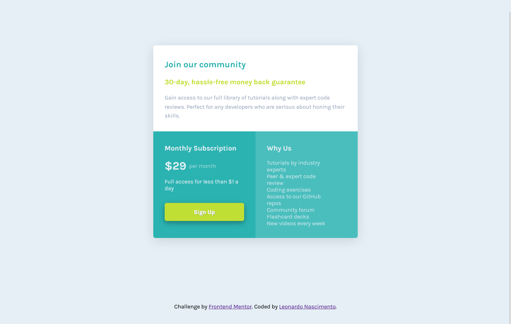

# Frontend Mentor - Article preview component solution

This is a solution to the [Single price grid component](https://www.frontendmentor.io/challenges/single-price-grid-component-5ce41129d0ff452fec5abbbc). Frontend Mentor challenges help you improve your coding skills by building realistic projects.

## Table of contents

- [Overview](#overview)
  - [The challenge](#the-challenge)
  - [Screenshot](#screenshot)
  - [Links](#links)
- [My process](#my-process)
  - [Built with](#built-with)
  - [What I learned](#what-i-learned)
  - [Continued development](#continued-development)
  - [Useful resources](#useful-resources)
- [Author](#author)
- [Acknowledgments](#acknowledgments)

## Overview

### The challenge

Users should be able to:

- View the optimal layout depending on their device's screen size

### Screenshot

#### Desktop Version

  

  
  #### Mobile Version
  

### Links

- Solution URL: [Code on Github](https://github.com/henrikkudesu/single-price-grid-component/)
- Live Site URL: [Github Pages Live URL](https://henrikkudesu.github.io/single-price-grid-component/)

## My process

I structured the html in a semantic way, then finished styling the elements with css.

### Built with

- Semantic HTML5 markup
- CSS custom properties
- Flexbox
- Mobile first

### What I learned

Nothing special. It was just a training challenge to keep improving my css skills.

### Useful resources

- [ChatGPT](https://chat.openai.com) - It helped me a lot. I don't need to waste time searching on Google or making a post on StackOverflow for possible solution for my problems. It is a great ally for studying.
- [W3Schools](https://www.w3schools.com) - W3Schools is a website optimized for learning, testing, and training. Examples might be simplified to improve reading and basic understanding.
- [5 simple tips to making responsive layouts the easy way - Kevin Powell](https://www.youtube.com/watch?v=VQraviuwbzU&pp=ugMICgJwdBABGAE%3D)
- [Responsive design made easy - Kevin Powell](https://youtu.be/bn-DQCifeQQ)
- [Conquering Responsive Layouts - Kevin Powell](https://courses.kevinpowell.co/view/courses/conquering-responsive-layouts/)

## Author

- Website - [henrikku blog](https://henrikkudesu.github.io/)
- Frontend Mentor - [@henrikkudesu](https://www.frontendmentor.io/profile/henrikkudesu)
- Twitter - [@henrikkudesu](https://twitter.com/henrikkudesu)
- LinkedIn - [Leonardo Nascimento](https://www.linkedin.com/in/leonardo-henrikku/)
